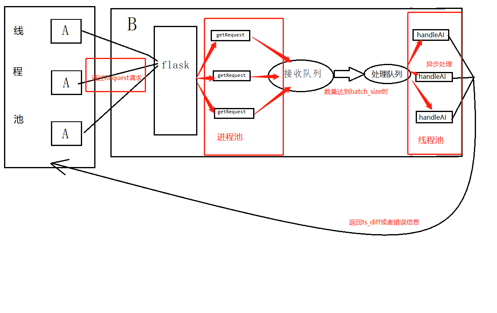
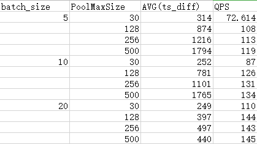

# 报告文档：

由于GIL(全局解释器锁)的存在，任一时间内只能有一个线程使用解释器，跟单CPU跑多程序类似，并不能做到真正的并发，当线程执行一个计算密集型的任务时，其他线程只能等待。所以我们这里使用ProcessPoolExecutor进程池来解决并发问题

## 代码：
A端中做Json数据处理，超时处理，异常处理，通过线程池，Request请求向B接口发起请求

B端做Json数据异常处理，
Queue值设置为1000，较大的长度可以用作缓冲，
使用进程池，来接收A端发起的请求，并加入到接收队列中
判断接收队列的长度，使用线程池+队列的模式，异步的进行AI操作
根据真实业务情况，判断每次执行AI操作的间隔，当请求数量不足batch_size或长时间未处理AI请求时，进行AI处理

## 结论：

当ThreadPoolExecutor Max值提高时，ts_diff有明显上升，QPS先小幅上升后基本保持不变
当batch_size提高时，ts_diff时间明显下降

### 原因
ThreadPoolExecutor内部维护一个无界队列，当提交的任务数超过了MaxPoolSize，会将当前的线程提交到一个block queue中，造成阻塞，如果线程池MaxSize过小，导致每次存活的请求数过少，接收队列Queue的长度也就过小，  从而影响ts_diff。线程池的大小也决定池内部是否频繁更新线程状态，当线程池MaxSize提高后，更新状态不那么频繁，QPS也就上升了
